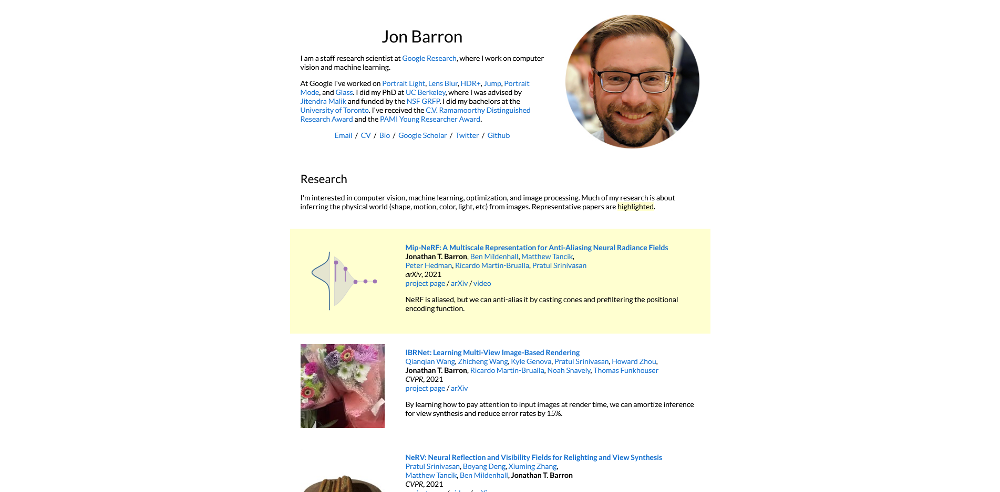
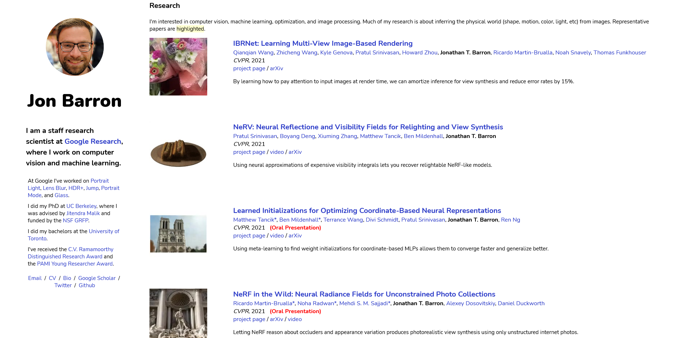

# Jon Barron's Portfolio Re-Design

## Overview

I wanted to practice my web design skills by making over an existing website.

## Screenshots

Before:

After:


## Links

- [original site](https://jonbarron.info/)
- [live redesign](https://juliaarrington.com/portfolio/jon)

## Changes I Made

- Moved profile to the side and made it sticky. I did this because I felt like his personal info and contact information are the most important part of the portfolio. This makes it easily accessable after the user looks through his research papers.
- Changed the font, style and weight. On the old website all the text looks the same and nothing is emphasised. I hope that my changes make it easier for the user to skim the site and find what they are looking for.
- Added a scroll to the top button. This site is so long (over 5000 lines of HTML), so I wanted scrolling up to be easier on the user.
- Got rid of the table based HTML. It's 2021. Say no to tables. This process took me several days, so hopefuly someone finds this project and uses it as their own.
- Made the JavaScript reusable (and moved it to another folder). For some reason the original designer wrote two new functions for each image. I was able to refactor it so that every image used the same two functions.
- Moved most of the CSS to it's own file. It's hard to make site wide changes when every element has it's own style tags.

## Worst HTML Snippet

```HTML
<p style="text-align: center">
      <name>Jon Barron</name>
</p>
```

## Continued Development

The biggest flaw of this site is that there is no mobile version. Maybe one day I will work on it, but right now I just want to be rid of this site. 😅
